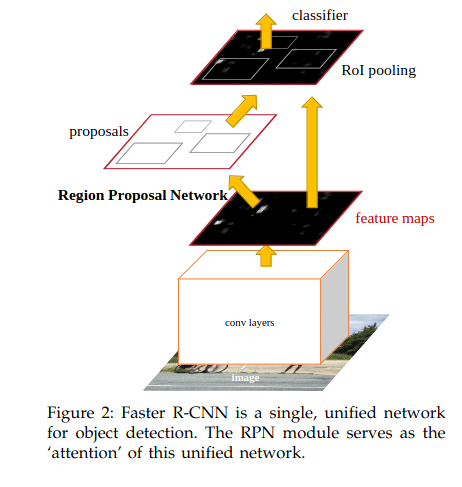
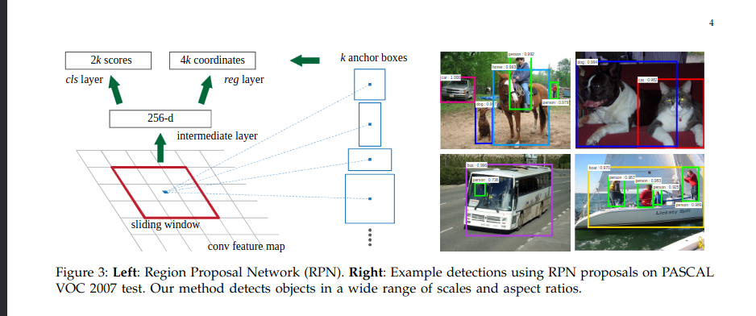
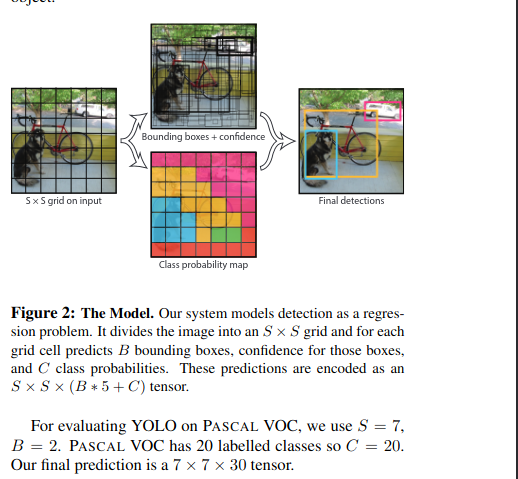
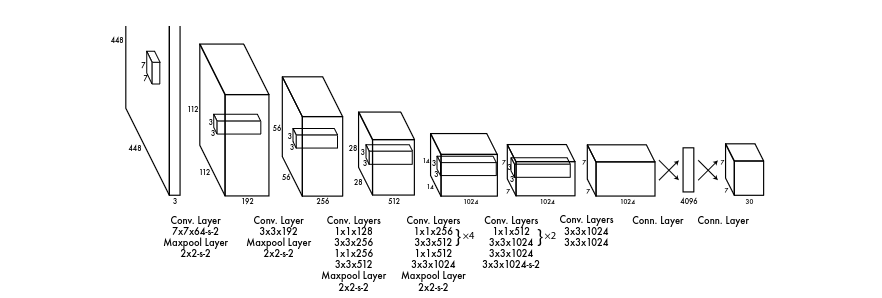
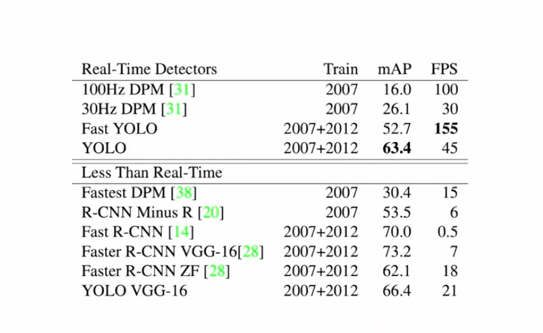

# Overview

# Brief Refresher of Faster R-CNN and YOLO

Step 1: Backbone Network for Feature Extraction

At the heart of Faster R-CNN is a robust architecture that starts with a backbone network, typically a deep convolutional neural network like VGG or ResNet. This backbone is responsible for extracting rich feature maps from the input image. As an image passes through this network, it is transformed into a high-dimensional feature map, preserving essential spatial and textural information while capturing complex patterns necessary for detecting objects. This feature map is crucial as it serves as the input for the subsequent stages of the model.
Step 2: Region Proposal Network (RPN) - The Anchor and Proposal Story

Next comes the Region Proposal Network (RPN), a key innovation of Faster R-CNN. The RPN scans the feature map using a sliding window approach and generates region proposals - potential bounding boxes that might contain objects. Here, anchor boxes play a pivotal role. Anchors are predefined boxes of various scales and aspect ratios that serve as references at each sliding window position. For each anchor, the RPN predicts two things: the likelihood of an object being present (objectness score) and the adjustments needed to refine the anchor to better fit the object (bounding box regression). These refined proposals are then filtered based on their objectness scores and Non-Maximum Suppression (NMS) to reduce redundancy, leaving us with a manageable number of proposals for the next step.
Step 3: ROI Heads - Classifying and Refining Proposals

Finally, the proposals enter the ROI (Region of Interest) heads. This stage consists of two components: the RoI Pooling layer and the box head. The RoI Pooling layer takes the irregularly shaped proposals and transforms them into a uniform size, ensuring that they can be processed by a fully connected network. This uniformity is vital for the next part - the box head, which comprises two parallel branches. One branch is responsible for classifying the content of each proposal into different object categories (including a background class). The other branch further refines the bounding box coordinates for each proposal, ensuring precise localization of the detected objects.

<!-- insert images-->

Step 1: Backbone Network for Feature Extraction

At the core of YOLO (You Only Look Once) lies a foundational architecture that commences with a backbone network, typically a deep convolutional neural network like VGG or ResNet. This backbone is tasked with extracting intricate feature maps from the input image. As the image traverses through this network, it undergoes transformation into a high-dimensional feature map, retaining crucial spatial and textural information while capturing intricate patterns essential for object detection. This feature map serves as a pivotal input for subsequent stages in the YOLO model.

Step 2: Detection at a Glance - Single Shot Multibox Detector (SSD)

In YOLO's innovative approach, the image is conceptualized as a grid of cells, where each cell, housing the center of an object, assumes responsibility for detecting that specific object. Within each cell, YOLO predicts B bounding boxes, each accompanied by a confidence score. This prediction involves determining whether an object exists within the bounding box and assessing how well the bounding box aligns with the object. The bounding box is defined by four coordinates, and a confidence score is calculated using Intersection over Union (IoU) between the predicted and ground truth boxes. Additionally, each grid cell provides a prediction about the class probability, presenting a conditional probability based on the presence of an object in the cell. The predictions are encoded in SxSx(5*B + C) tensors, where C represents the number of object classes.

Step 3: Network Architecture - A Unified View of Detection

The architecture of YOLO exhibits a carefully orchestrated sequence of layers. Commencing with a convolutional layer that extracts features, YOLO operates on the principle that each grid cell, while focusing on a specific area, maintains awareness of the entire image. Remarkably, a cell can predict a bounding box larger than its own spatial extent. YOLO's beauty lies in its ability to detect multiple objects in a single pass through the network.

Crucially, YOLO relies on proportional reasoning, eliminating the need to view the entire image for object localization. The architecture is adept at providing class-specific confidence scores by multiplying the confidence score with the class probability for a particular class. This unique methodology, captured beautifully in the YOLO architecture, enables efficient and accurate object detection.

# COMPARISION B/W YOLO and faster RCNN
 <!-- insert img from video comparing FPS and MaP score -->
 <!-- Elaborate the image -->

 

 The tradeoff between YOLO (You Only Look Once) and Faster R-CNN lies in the balance between speed and accuracy in object detection. YOLO, being a one-shot detection model, exhibits faster inference times by processing the entire image in a single pass. However, this efficiency may come at the cost of slightly lower accuracy, particularly in detecting small objects or intricate details.

In contrast, Faster R-CNN, with its two-stage approach of region proposal and classification, achieves higher accuracy by carefully refining object localization. Yet, this thoroughness can result in slower processing speeds, making it less suitable for real-time applications. The decision to choose between YOLO and Faster R-CNN hinges on the specific needs of a given task, with YOLO favored for speed-oriented applications and Faster R-CNN for tasks demanding higher precision.
